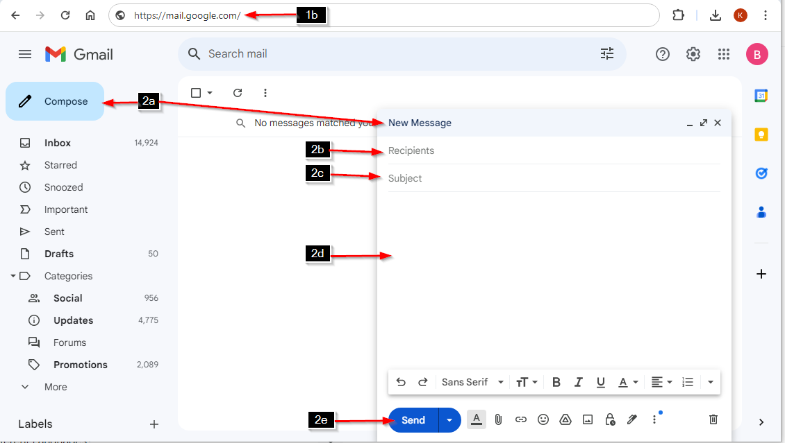

# Sample 1: Send an email using Gmail in a web browser

1. Open Gmail page 
   - a. Open any web browser. 
   - b. In the web browser, go to <https://mail.google.com/>
2. Write and send an email
   - a. At the top left, click the “Compose” button.  
   **Note:** At the bottom right, a new window appears with the “New Message” title.
   - b. In the “Recipients” field, add the recipient(s).
   - c. In the “Subject” field, type the subject of the message.
   - d. In the text area below “Subject”, write your message.  
   **Tip:** To change window size to full screen, click   at the top right of the window.
   - e. At the bottom of the window, click the “Send” button.  
   **Note:** At the bottom left of the page, a toast “Message sent” is displayed with two options: “Undo” and “View message”.
     
   **Important:** You have only a few seconds to click “Undo”.

