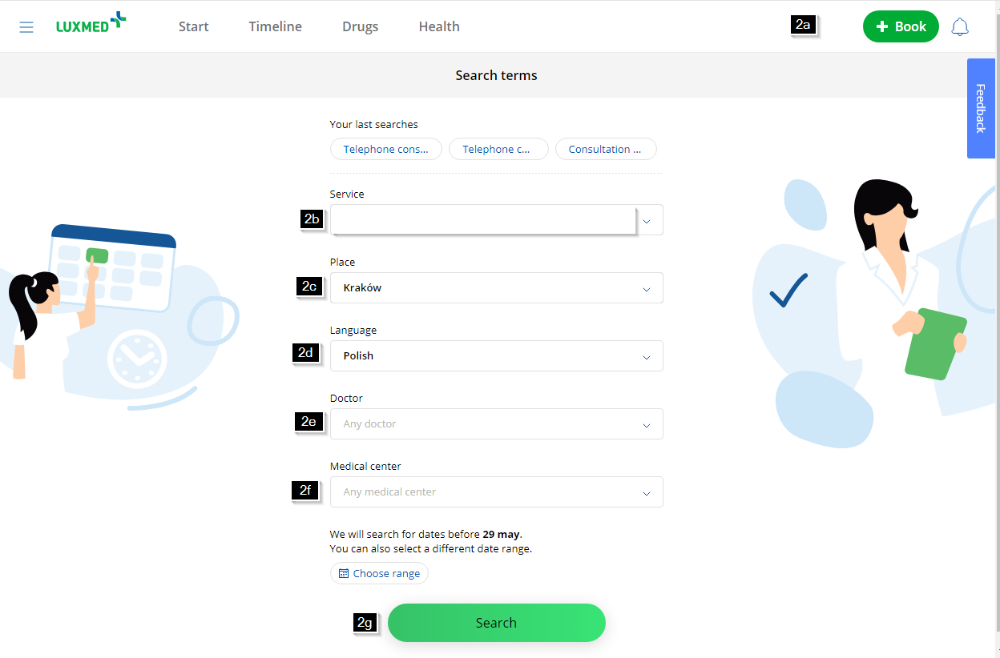

# Sample 2: Book a medical appointment in the "Patient Portal"

1. Open "Patient Portal" page 
   - a. Open any web browser. 
   - b. In the web browser, go to <https://portalpacjenta.luxmed.pl/>
2. Search for an appointment 
   - a. At the top right, click the “Book” button.  
   **Tip:** At the top, there is a list with your last 3 search criteria. 
   - b. In the “Service” field, select the desired medical service.  
   **Note:** A list of matching services appears as you type. 
   - c. In the “Place” field, type the desired location.  
   **Note:** A list of matching places appears as you type. 
   - d. In the “Language” field, select your language. 
   - e. (Optional) In the “Doctor” field, select the doctor(s).  
   **Note:** A list of matching doctors appears as you type. You can select up to 5 doctors. 
   - f.	(Optional) In the “Medical center” field, select the medical center(s) for the place selected in the previous step.  
   **Note:** A list of matching medical centers appears as you type. You can select up to 5 medical centers. 
   - g. At the bottom, click the “Search” button.  
   **Note:** Available medical appointments are displayed as rows grouped by dates. 
3. Book an appointment 
   - a. Put the mouse on a row with the desired medical appointment.
   - b. On the right side of the row, click the “Book a visit” button.
   - c. Review the booking details and click the “Confirm your visit” button.

