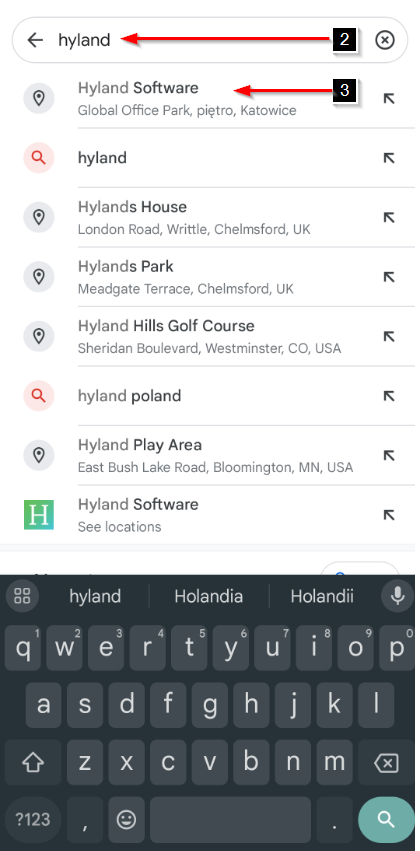
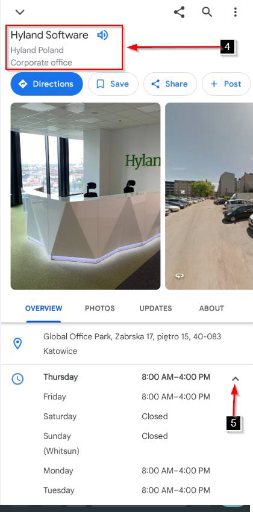

# Sample 3: Check business hours for a place in Google Maps on a mobile device

1. On your mobile device, open Google Maps app.
2. At the top, click the “Search” box and type the name of a place.  
**Note:** A list of matching places appears as you type. 
3. Click the place you want from the list. 
4. To check business hours for the whole week, at the top of the panel, click the name of the place. 
5. In the “Overview” section at the bottom, click second row marked with clock icon.

|&nbsp;&nbsp;&nbsp;|&nbsp;&nbsp;&nbsp;|